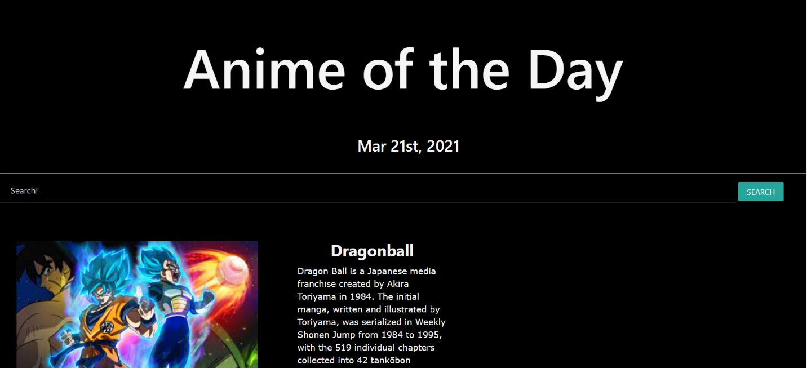

# Anime of the Day

## Project Description

* This purpose of this repository is to create an Anime of the Day web application. 

* This is a group collagoration project app that gives you the anime of the day, a quick description, and a gif. You even have the option to change the giphy during your search, and can choose from 5 options.

---

## User Story

* As a user, I'm getting dry in the group messages and I need to keep my meme game spicy!

* As a user I want to learn more about anime and have a spicy meme to implement, while increasing my knowledge.

---

 ## API's Used

 * Giphy API - This API is widley used when you want to keep your meme game spicy. 

 * Wiki API - This API has a considerable amount of information about numerous topics and it made sense to tie it in with the giphy api, to increase the UI/UX design for optimal user interface.

 ---

 ## CSS Framework

 * Materialize CSS - We chose this css framework because it provides some similar aspects to bootstrap and it is one of the libraries what Google uses for its web development.

 * Based on material design, this CSS library also provides a more modern responsive front-end for the user.

 * Using this provided the robust and visually appealing response we were looking for in a CSS llibrary.

 ---

 ## Wireframe

*   This is a mock-up of the Anime of the Day app.

* Wireframe Link: [Anime-of-the-Day](https://docs.google.com/presentation/d/1Cw4x1pjDMnY0CcnBBQf8AQIj3CH5bPtu6BLXaQxB7KY/edit?usp=sharing)

---

## Screenshots of Production

* This is one of the first versions during the production process.

* This is what it looks like during the final stages.

* This is the final look for the project presentation, with more to come.

---

## Links to GitHub Reop & Deployed Link

* Gitub Repo Link: [Github.com](https://github.com/sawhite110/Anime-of-the-Day)

* Github Hosted Application Link: [Anime-of-the-Day]( https://sawhite110.github.io/Anime-of-the-Day/)

 ### Group Members
 
 * Stevenson White II
 * Taylor Lilley
 * Brian McMullen
 * Henry Vernon